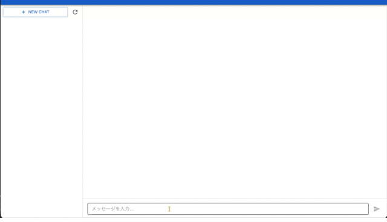
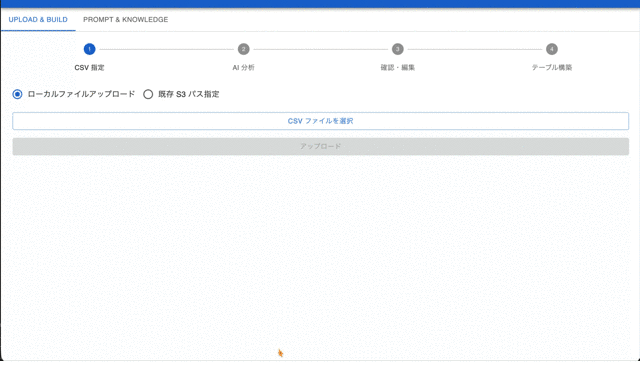
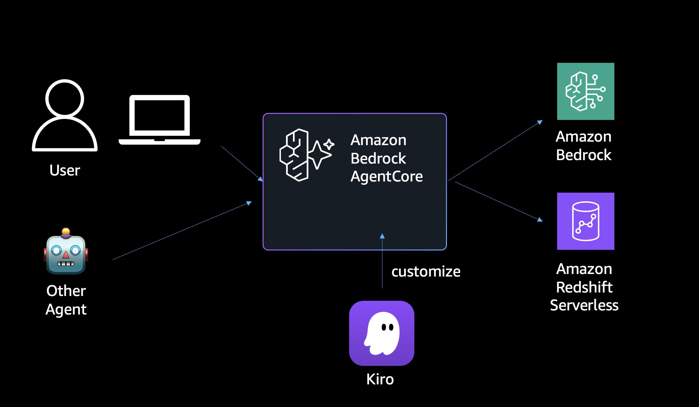
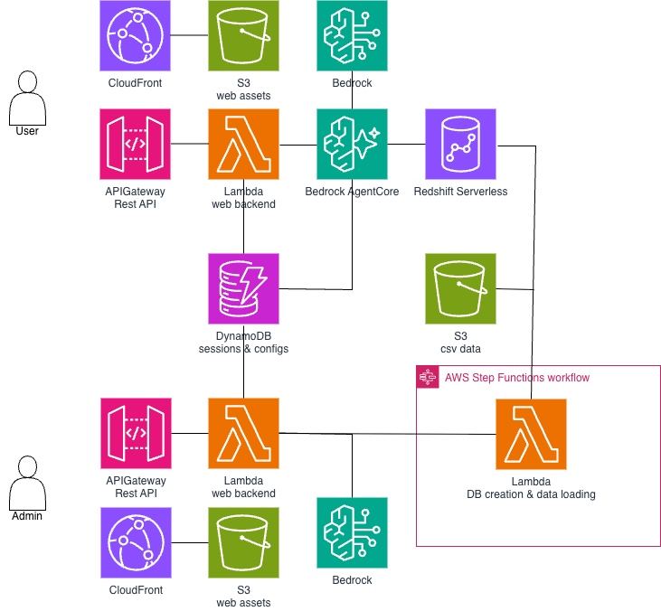

# 📊 sample-text2sql-agent （Agentic Decision Making）

## 🤖 CSV を用意するだけで始める、意思決定のための AI エージェント

CSV を S3 に置くだけで、自社データに対して自然言語で問い合わせできる AI エージェント環境が AWS にデプロイされます。エージェントは自律的にデータを探索し、SQL を組み立て、結果を解釈して回答やチャートを返します。単にクエリを代行するのではなく、業務知識（セマンティックレイヤー）を前提として、次のアクション提案までを担えるよう設計されています。人間は問いを投げ、結果をレビューし、意思決定に集中できます。

## ✨特徴

- 🚀 **ワンクリックデプロイ** — AWS アカウントがあれば、[ここ（準備中）]() からすぐにデプロイ可能
- 📁 **CSV アップロードで即開始** — S3 に CSV を置くだけで AI がスキーマを自動生成
- 🗣️ **自然言語でデータに問い合わせ** — SQL を書かずに、日本語で質問するだけ
- 📊 **チャート自動生成** — 棒グラフ・折れ線グラフ・円グラフを AI が自動で描画
- 🔄 **ストリーミング応答** — リアルタイムで AI の回答を表示
- ⚙️ **ノーコードカスタマイズ** — システムプロンプト・スキーマ・ナレッジを管理画面から編集
- 🔐 **Cognito 認証** — Agent UI / Admin UI それぞれに独立した認証
- 🛡️ **WAF 保護** — IP 制限による API Gateway の保護

## 🎥 デモ

### Agent UI — 自然言語でデータに問い合わせ

自然言語で質問を入力すると、AI が SQL を自動生成・実行し、結果をテキストやチャートで返します。

### Admin UI — ノーコードでエージェントをカスタマイズ

管理画面からシステムプロンプト、データベーススキーマ、ナレッジを編集できます。CSV のアップロードとスキーマ自動生成もここから実行します。

## 🧰 前提条件

- Amazon Bedrock / Amazon Bedrock AgentCore / Amazon Redshift Serverless が利用可能なリージョンであること（動作確認は `ap-northeast-1`）
- Bedrock のモデルが利用可能であること（デフォルト: `global.anthropic.claude-sonnet-4-6`、`cdk.json` で変更可）

> 💰 Redshift Serverless・AgentCore Runtime・Bedrock モデル呼び出しなどに応じた利用料金が発生します。検証後に不要な場合は環境を削除してください。

## 🚀 クイックスタート

- [ワンクリックデプロイ（準備中）]() から簡単にデプロイできます。
- cdk でデプロイする場合は、[手動デプロイ手順](docs/MANUAL_DEPLOYMENT.md) を参照してください。

## 📖 使い方

- [動作確認](docs/OPERATION.md) を参照してください。

## 🛠️ Kiro から Agent を作成する / 使う

本リポジトリには [Kiro](https://kiro.dev/) 用の Skill を `.kiro/skills/` 配下に同梱しています。Kiro のチャットから自然言語で Agent 設定の参照・変更や、Agent への問い合わせができます。

> Kiro における Skill の概念や有効化方法は [Kiro 公式ドキュメント](https://kiro.dev/docs/) を参照してください。Kiro のチャットパネルで `/` を入力すると、利用可能な Skill を一覧から選択して呼び出せます。

- **[`agent-admin`](.kiro/skills/agent-admin/SKILL.md)** — Agent の新規作成と、Agent の設定（System Prompt / Knowledge）を参照・更新する Skill。
    - 例:「system_prompt をこの内容に更新して」「Knowledge を追加して」「売上分析用の新しい Agent を作って」
- **[`agent-chat`](.kiro/skills/agent-chat/SKILL.md)** — Agent に自然言語で質問を送り、SQL 実行結果を返す Skill。
    - 例:「先月の売上上位 5 商品を教えて」「カテゴリ別の売上傾向を見せて」

前提条件やコマンド例は各 `SKILL.md` を参照してください。

## 🏗️ アーキテクチャ
### 概要

### 詳細

## 📚 ドキュメント

- [手動デプロイ手順](docs/MANUAL_DEPLOYMENT.md) — 詳細なデプロイ手順とトラブルシューティング
- [動作確認](docs/OPERATION.md) — デプロイ後の動作確認手順
